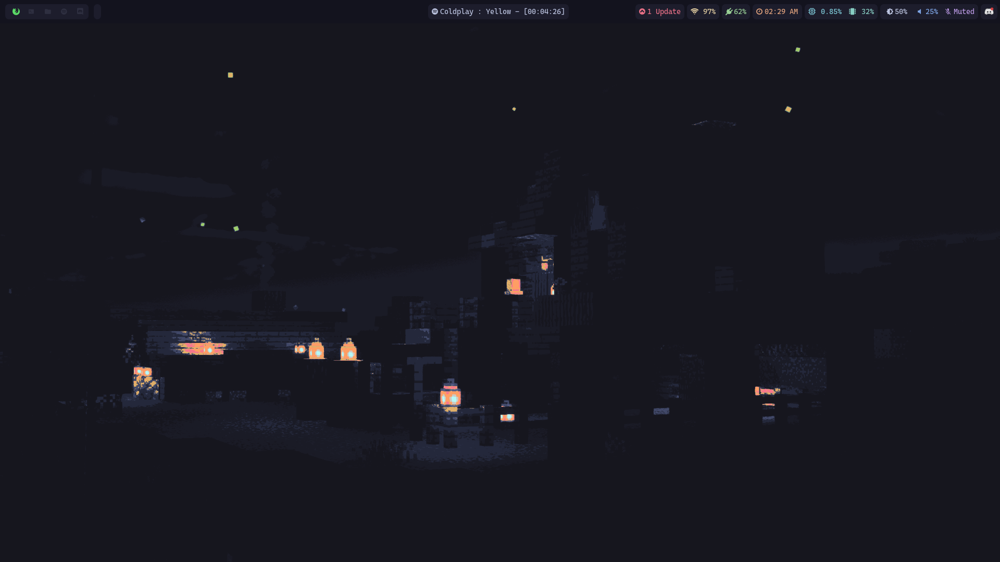
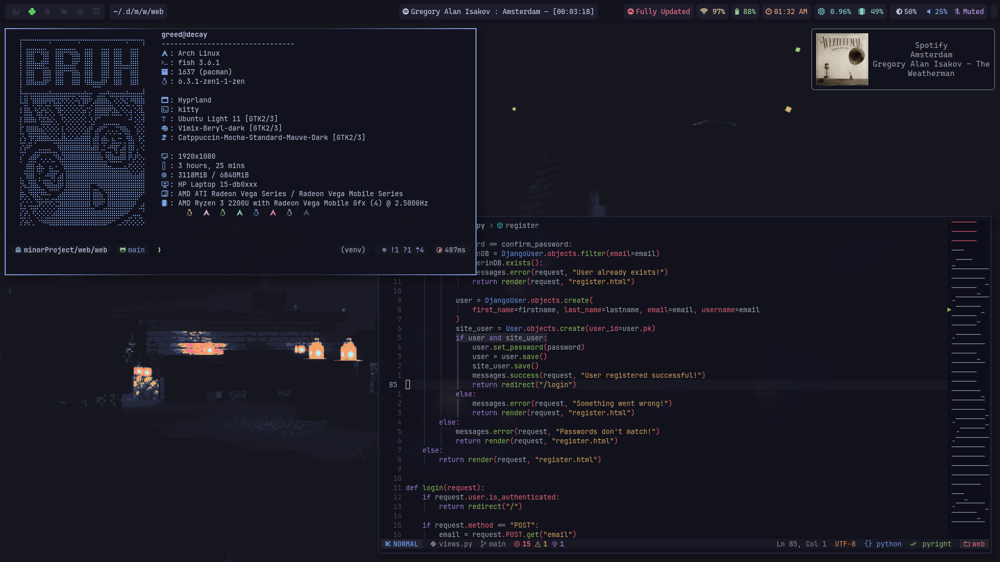

# Dotfiles

### Wallpapers moved to `wallpapers` repository

Place where my dotfiles reside :

You can check for respective WM with the given links below

## [Qtile](https://github.com/greeid/.dotfiles/tree/main/qtile/.config/qtile)

My qtile config

## [BSPWM](https://github.com/greeid/.dotfiles/tree/main/bspwm/.config/bspwm)

## [Hyprland](https://github.com/greeid/.dotfiles/tree/main/hypr/.config/hypr)

## [Rofi](./rofi/.config/rofi/)

- Taken from : [@adi1090x](https://github.com/adi1090x/rofi)
