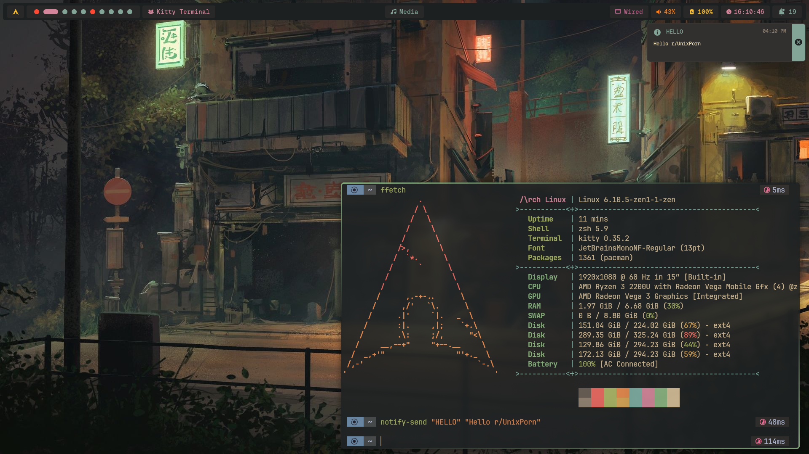
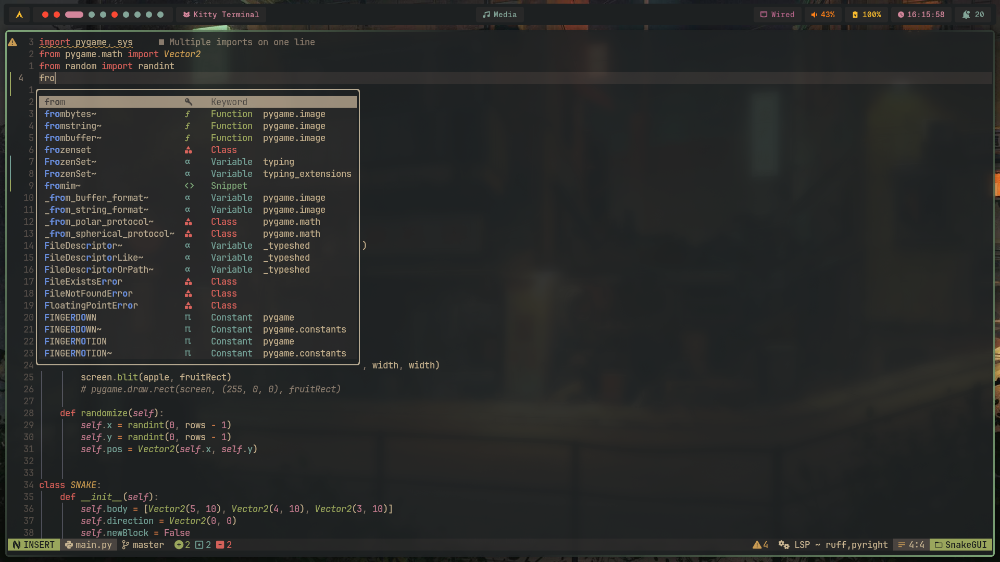

# Dotfiles

> [!NOTE]  
> `wallpapers` moved to [wallpapers](https://www.github.com/greeid/wallpapers) repository

> [!NOTE]
> Neovim config is in [nvim-conf](https://github.com/greeid/nvim-conf) repo 

## Gruvbox branch for my dots

You can check for respective WM with the given links below

## [Hyprland](https://github.com/greeid/.dotfiles/tree/main/hypr/.config/hypr)

