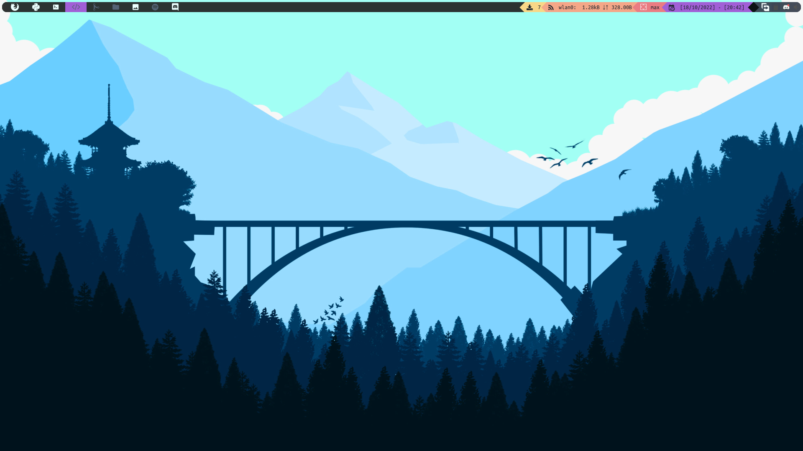
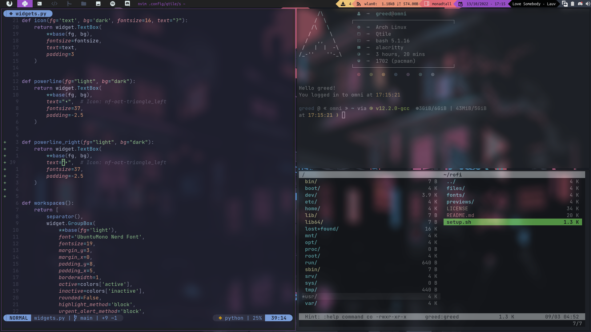
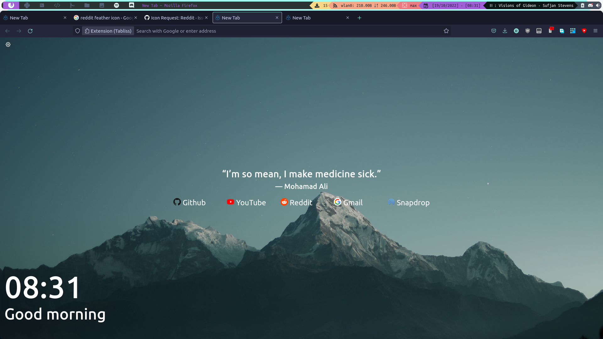

# dotfile

It's a collection of my dotfiles

## Qtile :






- Terminal Theme : [Catppuccin (Mocha Flavour)](https://github.com/catppuccin/alacritty)
- Neovim Theme : [Catppuccin (Mocha Flavour)](https://github.com/catppuccin/nvim)
- Terminal Font : [Caskaydia Cove](https://github.com/ryanoasis/nerd-fonts/releases/download/v2.2.2/CascadiaCode.zip)
- Firefox : [Tabliss](https://tabliss.io/)
- Discord : [Catppuccin (Mocha Flavour)](https://github.com/catppuccin/discord)
- Spotify : [Spicetify : Comfy theme](https://github.com/Comfy-Themes/Spicetify)

### Installation (Arch Based) :

Install qtile and it's dependencies :

```bash
sudo pacman -S qtile pacman-contrib
paru -S nerd-font-mono-ubuntu
pip3 install psutil
```

Install Stow :

```bash
sudo pacman -S stow
```

Clone this repo:

```bash
https://github.com/Greed058/.dotfiles
```

and use stow to implement all of my config :

```bash
stow */
```

If you want a specific config folder(say neovim):

```bash
stow nvim
```

In case the network widget is not working use `ip address` to find your wireless modem, then :

```python
#Open the file ../qtile/settings/widget.py :

#Here you should find a list called *primary_widget*
#Find the line :

    widget.Net(**base(bg='color3'), interface='wlan0',
               mouse_callbacks={'Button1': lazy.spawn('iwgtk')}),

#Change the interface argument to your modem name, in my case 'wlan0'
```

Remember all of the keybinding will not work unless if finds all the apps I use :
To install all of the apps I use :

```bash
sudo pacman -S rofi betterlockscreen firefox discord pcmanfm alacritty redshift scrot
```

I also have some scripts for minor things like screenshot and toggling the mic.
You can find them in `../qtile/scripts.`

### Autostart

I have an autostart script that autostarts stuffs like the systray icons and compositor

To get the systray icons :

```bash
sudo pacman -S cbatticon pamixer picom
```

You can change if you don't like something starting up on `../qtile/autostart.sh`

### Themes:

The themes are stored in `../qtile/themes/`. They are nothing but simple json file :

```json
{
  "black": ["#000000", "#000000"],
  "dark": ["#212121", "#212121"],
  "grey": ["#353c4a", "#353c4a"],
  "light": ["#f1ffff", "#f1ffff"],
  "text": ["#0f101a", "#0f101a"],
  "focus": ["#a151d3", "#a151d3"],
  "active": ["#f1ffff", "#f1ffff"],
  "inactive": ["#4c566a", "#4c566a"],
  "urgent": ["#F07178", "#F07178"],
  "color1": ["#a151d3", "#a151d3"],
  "color2": ["#F07178", "#F07178"],
  "color3": ["#fb9f7f", "#fb9f7f"],
  "color4": ["#ffd47e", "#ffd47e"]
}
```

## Rofi

Rofi is a window switcher, run dialog, ssh-launcher started as a clone of simpleswitcher.

This is what my rofi looks like :


- Theme : One Dark
