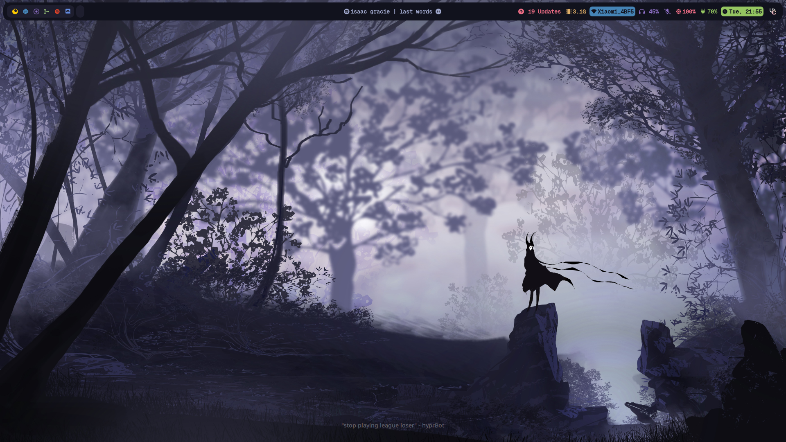
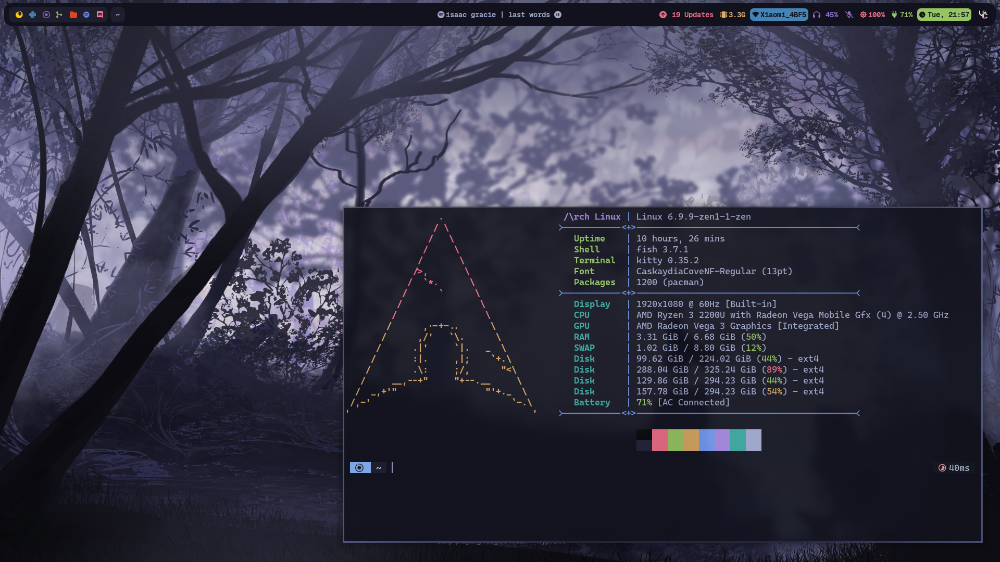
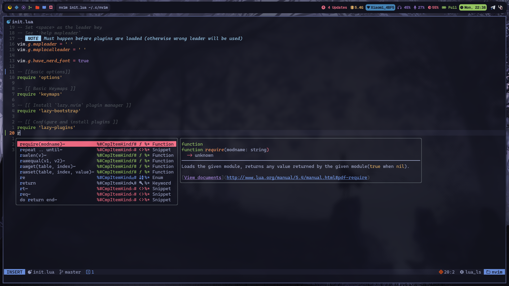
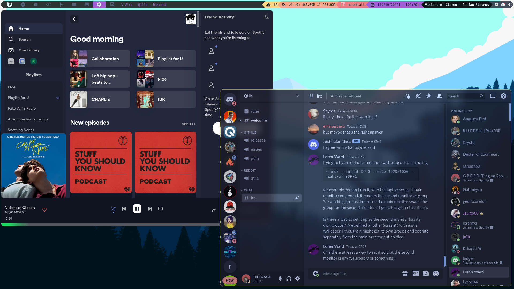
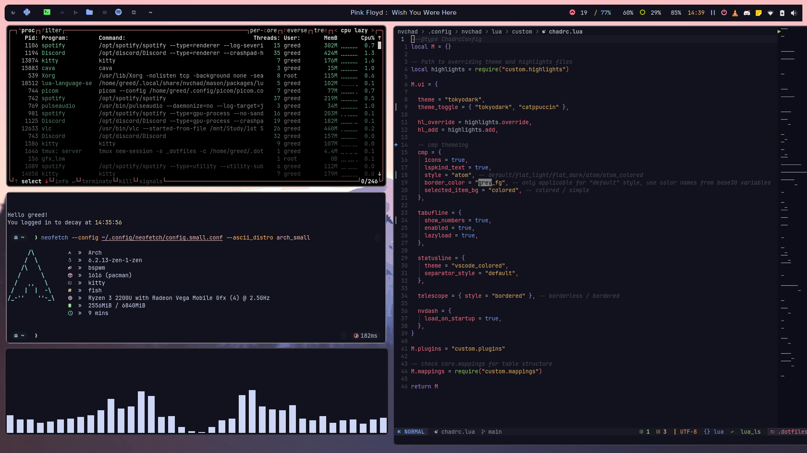

# Dotfiles

> [!NOTE]  
> `wallpapers` moved to [wallpapers](https://www.github.com/greeid/wallpapers) repository

> [!NOTE]
> Neovim config is in [nvim-conf](https://github.com/greeid/nvim-conf) repo 

Place where my dotfiles reside :

### Check gruvbox branch for gruvbox theme

You can check for respective WM with the given links below

## [Hyprland](https://github.com/greeid/.dotfiles/tree/main/hypr/.config/hypr)

## [Qtile](https://github.com/greeid/.dotfiles/tree/main/qtile/.config/qtile) (No longer maintained)

My qtile config

## [BSPWM](https://github.com/greeid/.dotfiles/tree/main/bspwm/.config/bspwm) (No longer maintained)

## [Rofi](./rofi/.config/rofi/)

- Catppuccin Mocha
