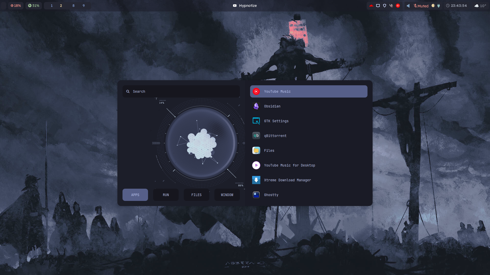
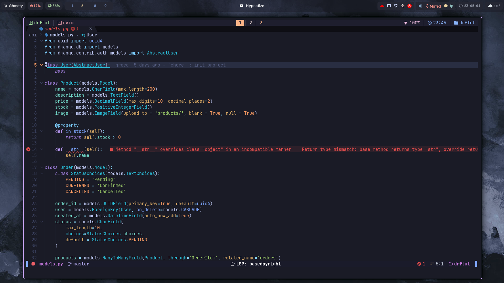
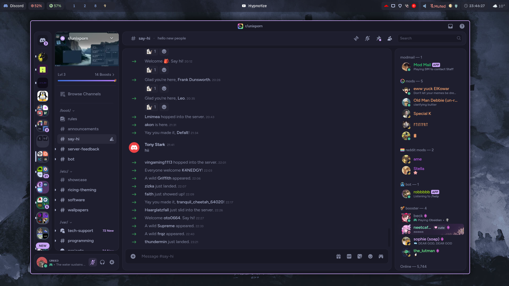

# Dotfiles
## Niri Branch for my dotfiles:

> [!NOTE]  
> `wallpapers` moved to [wallpapers](https://www.github.com/greeid/wallpapers) repository

> [!NOTE]
> Neovim config is in [nvim-minimal](https://github.com/greed-d/nvim-minimal) repo 

> [!NOTE]
> Click on WM name for more screenshots and installation process

## Niri

### Wallpaper

### Fetch

### Rofi

### [Neovim](https://github.com/greed-d/nvim-minimal)

### Discord

## Star History

