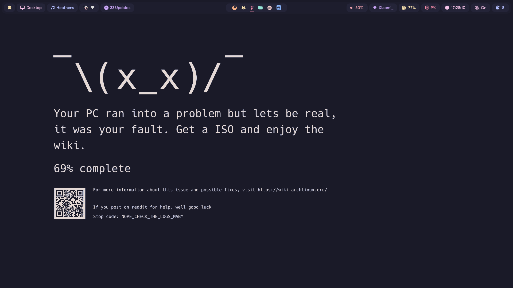
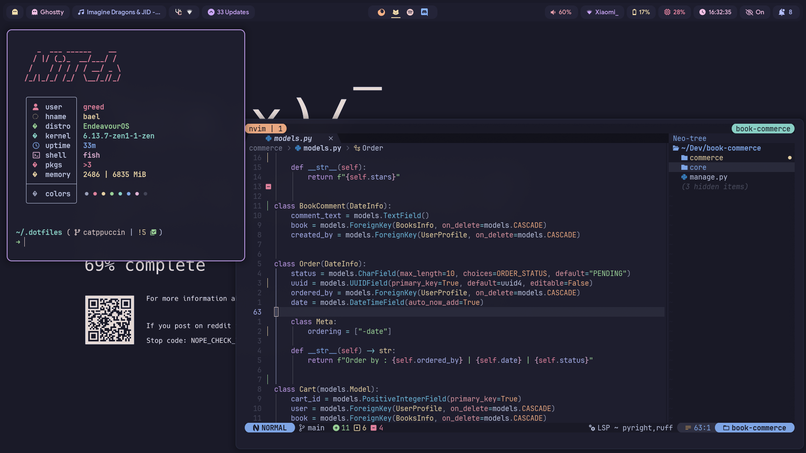

# Dotfiles
## Place where my dotfiles reside :

> [!NOTE]  
> `wallpapers` moved to [wallpapers](https://www.github.com/greeid/wallpapers) repository

> [!NOTE]
> Neovim config is in [nvim-minimal](https://github.com/greed-d/nvim-minimal) repo 

> [!NOTE]
> Click on WM name for more screenshots and installation process

## [Hyprland](https://github.com/greeid/.dotfiles/tree/main/hypr/.config/hypr)
### Wallpaper

### Fetch

### [Neovim](https://github.com/greed-d/nvim-minimal)

## Star History

