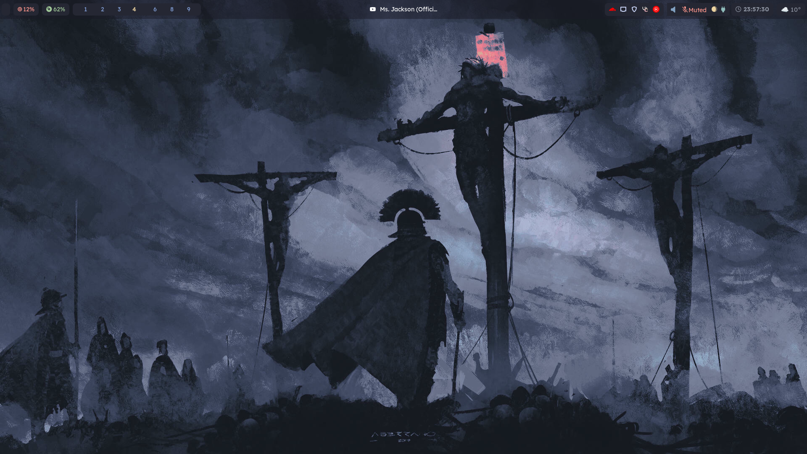
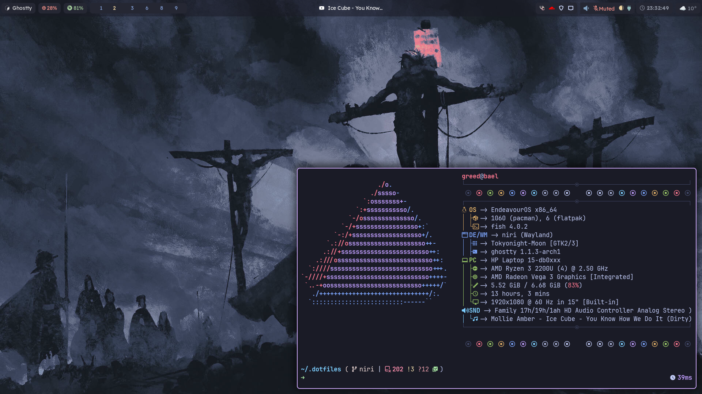
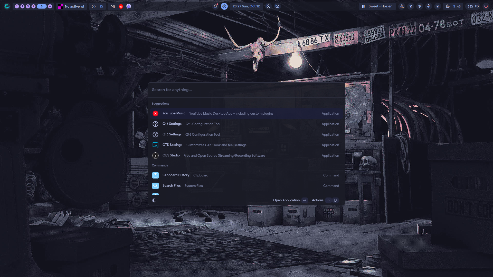
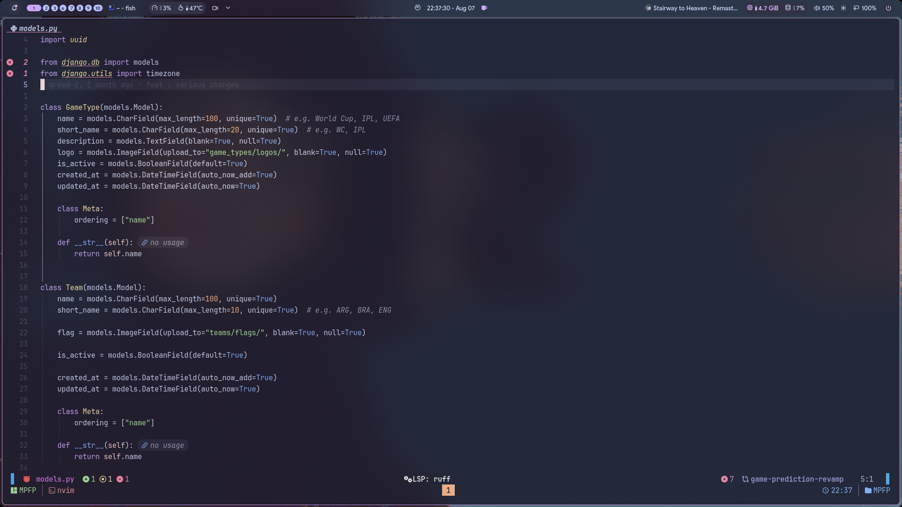
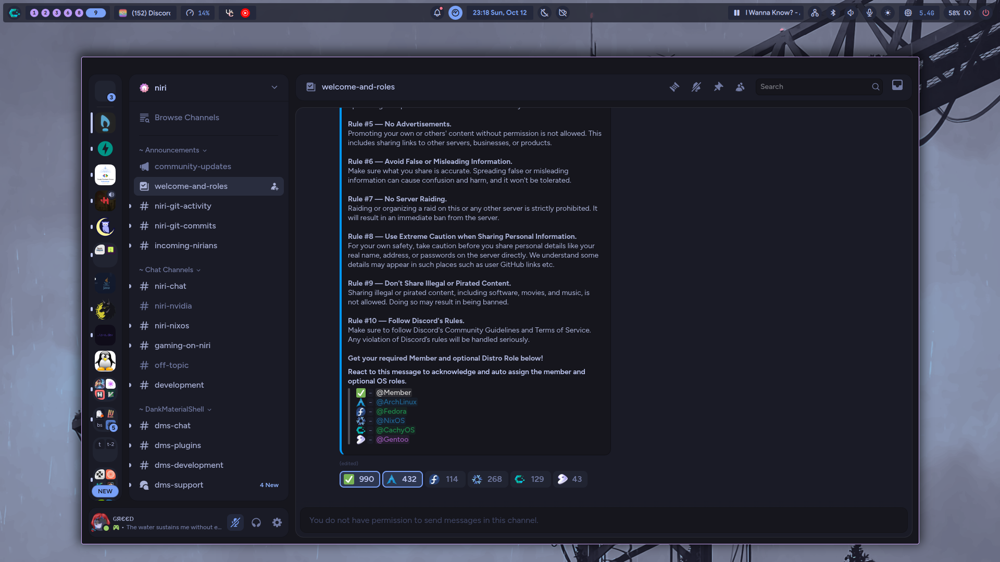

# Dotfiles

## A tokyonight rice

## Niri Branch for my dotfiles:

> [!NOTE]  
> `wallpapers` moved to [wallpapers](https://www.github.com/greeid/wallpapers) repository

> [!NOTE]
> Neovim config is in [nvim](https://github.com/greed-d/nvim) repo

> [!NOTE]
> Click on WM name for more screenshots and installation process

## Screenshots

### Wallpaper

### Fetch

### Rofi

### [Neovim](https://github.com/greed-d/nvim)

### Discord

## Star History

