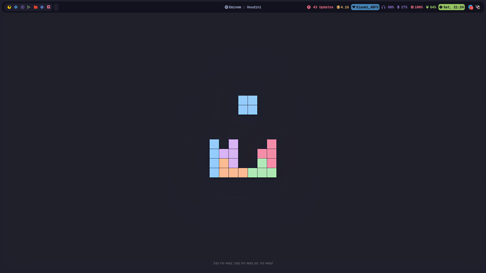
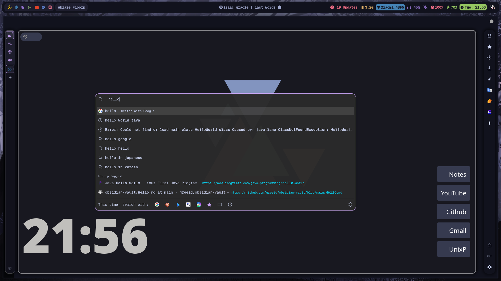
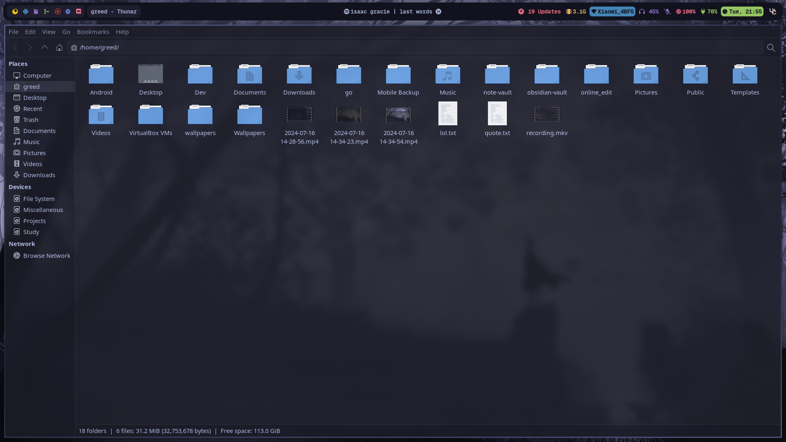
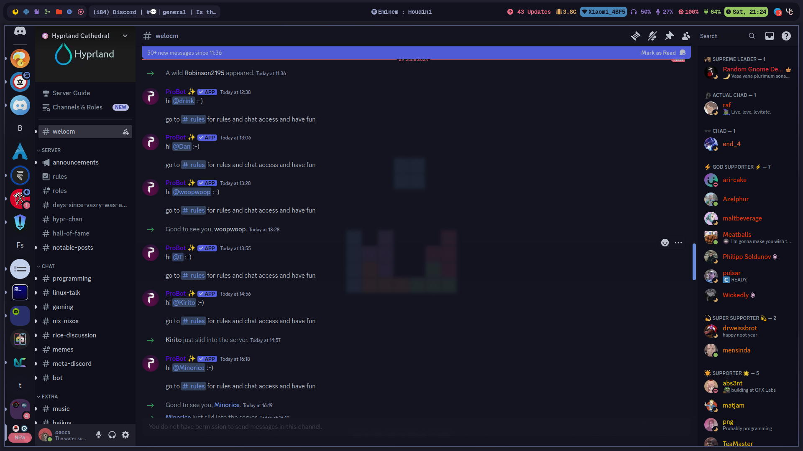

# Hyprland Dots

## These dots are highly optimized for my daily usecase, if you're trying to use it, it'd need more tweaking from your side

### Stuffs used :

| Stuffs used   | Links | 
|:----------:   | :---: | 
| AUR Helper    | [paru](https://github.com/Morganamilo/paru)            |
| Browser       | [floorp](https://floorp.app/en)            |
| Fetch         | [pfetch](https://github.com/dylanaraps/pfetch) | 
| File Explorer | thunar            |
| Terminal      | [alacritty](https://github.com/dylanaraps/pfetch) |
| Discord Client| [vesktop](https://github.com/Vencord/Vesktop)                  |
| Spotify Theme | [tokyo night](https://github.com/Gspr-bit/Spotify-Tokyo-Night-Theme) [with my own little tweaks]                   |
| GTK theme     | [Lavanda Dark Compact Tokyonight](https://github.com/mehedirm6244/Miserable_Xfce/tree/Serenade/home/.themes/Lavanda-Dark-Compact-Tokyonight)                   |


### Screenshots :











### Installation : 

Install hyprland and other packages

```bash
sudo pacman -S hyprland swaync hyprpaper hypridle hyprlock otf-geist-mono-nerd  pacman-contrib alacritty thunar spotify-launcher fish
paru -S waybar-git ttf-caskaydia-mono-nerd rofi-lbonn-wayland-only-git
```

Install Stow
```bash
sudo pacman -S stow
```

Clone the repo : 
```bash
git clone https://github.com/greeid/.dotfiles ~/.dotfiles/
```
Stow the repo

```bash
cd ~/.dotfiles/
stow hypr/ alacritty/ fish/ scripts/ rofi/
```
 > [!NOTE]  
> More packages may be needed to be installed in order for WM to work properly


> [!IMPORTANT]  
> I will not provide support for the dots, it's here purely for reference, if you'd want to use it you're on your own

> [!WARNING]  
> **DO NOT** run this as your basic daily driver if you don't know hwat you're doing

