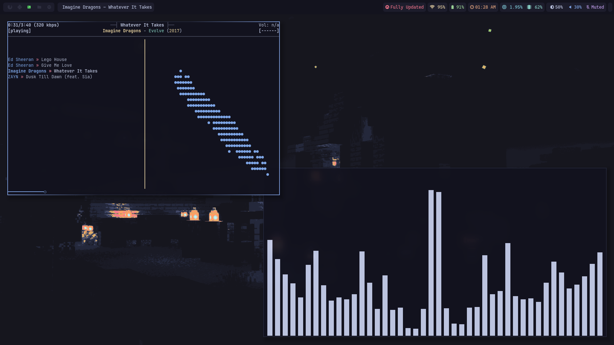
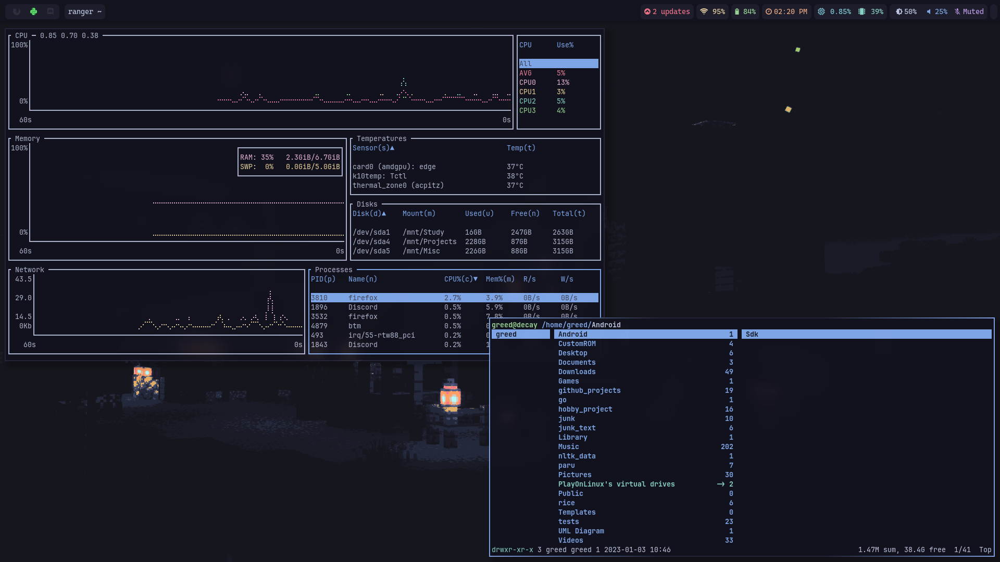
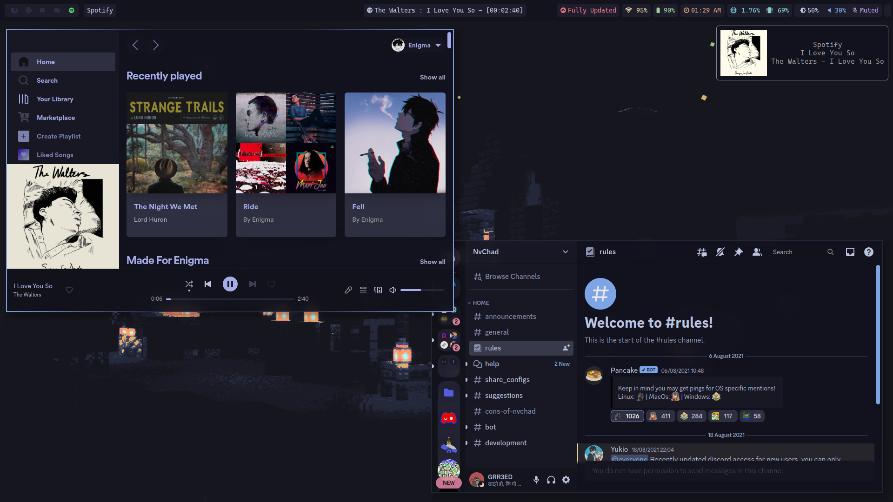
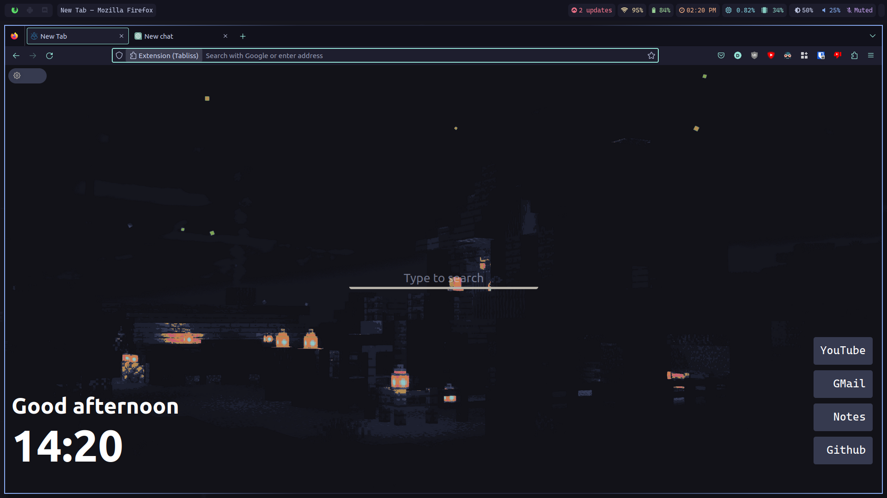

# Hyprland :

## Tokyo Dark:

 



 

- Terminal Theme :
  [Catppuccin (Mocha Flavour)](https://github.com/catppuccin/alacritty)
- Neovim Distro : [NvChad](https://nvchad.com)
- Terminal Font :
  [Jet Brains Mono](https://github.com/ryanoasis/nerd-fonts/releases/download/v2.3.3/JetBrainsMono.zip)
- Spotify Theme : [Spicetify](https://spicetify.app/)

### :arrow_down: Installation (Arch Based) :

Install hyprland and it's dependencies :

```bash
sudo pacman -S hyprland
paru -S ttf-jetbrains-mono-nerd ttf-cascadia-code-nerd
```

Install Stow :

```bash
sudo pacman -S stow
```

Clone this repo:

```bash
https://github.com/greeid/.dotfiles
```

and use stow to implement all of my config :

```bash
stow */
```

If you want a specific config folder(say neovim):

```bash
stow nvim
```

## Keybindings :keyboard:

| Bindings      | Actions |
| ----------- | ----------- |
| Mod + Enter      | Open Ternimal (Alacritty)       |
| Mod + w   | Exit window        |
| Mod + Space      | Open rofi       |
| Mod + t      | Toggle notification center |
| Mod + s   |  Toggle floating window        |
| Mod + i   | Change Tiling Layout |
| Mod + v      | Show clipboard history |
| Mod + Shift + q   |  Shutdown       |
| Mod + Ctrl + q   | Log Out |
