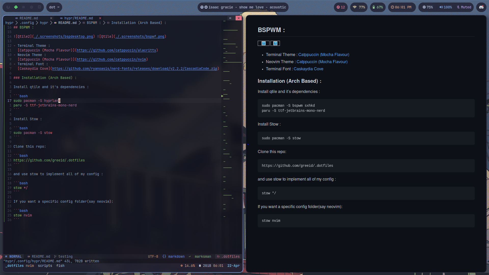

## Hyprland :

 



https://user-images.githubusercontent.com/58597122/234779108-75106998-dc35-40c9-a18c-e3bba723b43e.mp4


- Terminal Theme :
  [Catppuccin (Mocha Flavour)](https://github.com/catppuccin/alacritty)
- Neovim Theme :
  [Catppuccin (Mocha Flavour)](https://github.com/catppuccin/nvim)
- Terminal Font :
  [Jet Brains Mono](https://github.com/ryanoasis/nerd-fonts/releases/download/v2.3.3/JetBrainsMono.zip)

### :arrow_down: Installation (Arch Based) :

Install hyprland and it's dependencies :

```bash
sudo pacman -S hyprland
paru -S ttf-jetbrains-mono-nerd
```

Install Stow :

```bash
sudo pacman -S stow
```

Clone this repo:

```bash
https://github.com/greeid/.dotfiles
```

and use stow to implement all of my config :

```bash
stow */
```

If you want a specific config folder(say neovim):

```bash
stow nvim
```
