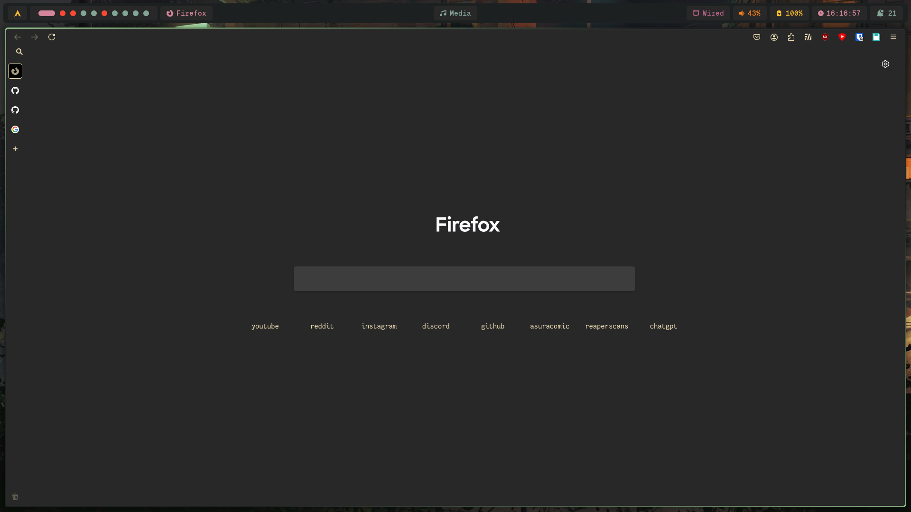
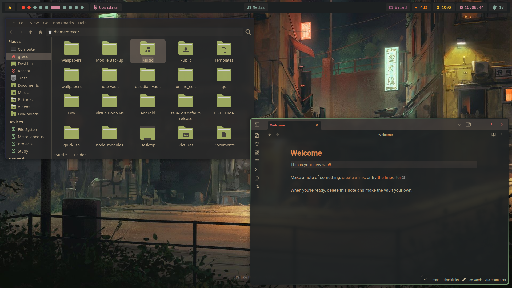
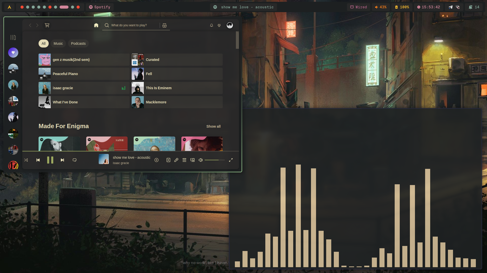
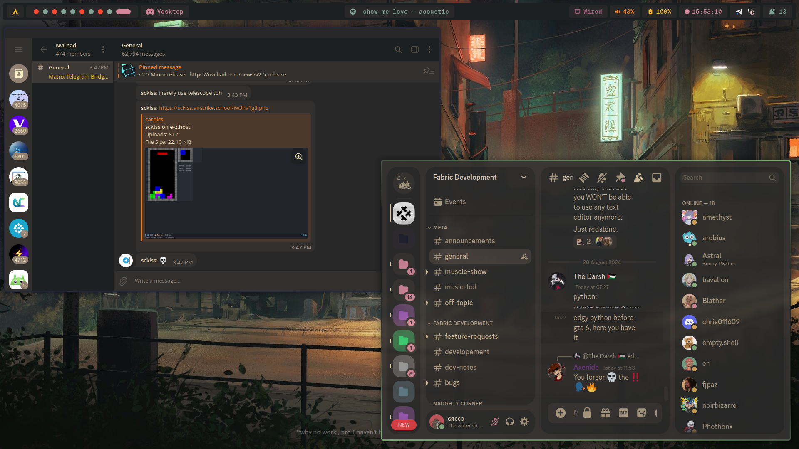

# Hyprland Dots

## These dots are highly optimized for my daily usecase, if you're trying to use it, it'd need more tweaking from your side

### Stuffs used :

| Stuffs used   | Links | 
|:----------:   | :---: | 
| AUR Helper    | [paru](https://github.com/Morganamilo/paru)            |
| Browser       | [firefox]()            |
| Fetch         | [fastfetch](https://github.com/fastfetch-cli/fastfetch) | 
| File Explorer | thunar |
| Terminal      | [kitty](https://sw.kovidgoyal.net/kitty/) |
| Discord Client| [vesktop](https://github.com/Vencord/Vesktop) |
| Spotify Theme | [Dribble's Gruvbox](https://github.com/spicetify/spicetify-themes) [with my own little tweaks]  |
| GTK theme     | [Gruvbox Material GTK theme](https://github.com/TheGreatMcPain/gruvbox-material-gtk?tab=readme-ov-file)  |


### Screenshots :












### Installation : 

Install hyprland and other packages

```bash
sudo pacman -S hyprland swaync hyprpaper hypridle hyprlock otf-geist-mono-nerd  pacman-contrib alacritty thunar spotify-launcher fish nwg-look
paru -S waybar-git ttf-caskaydia-mono-nerd rofi-lbonn-wayland-only-git gruvbox-material-gtk-theme-git gruvbox-material-icon-theme-git
```

Install Stow
```bash
sudo pacman -S stow
```

Clone the repo : 
```bash
git clone https://github.com/greeid/.dotfiles ~/.dotfiles/
```
Stow the repo

```bash
cd ~/.dotfiles/
stow hypr/ alacritty/ fish/ scripts/ rofi/
```
 > [!NOTE]  
> More packages may be needed to be installed in order for WM to work properly

> [!WARNING]  
> **DO NOT** run this as your basic daily driver if you don't know what you're doing

