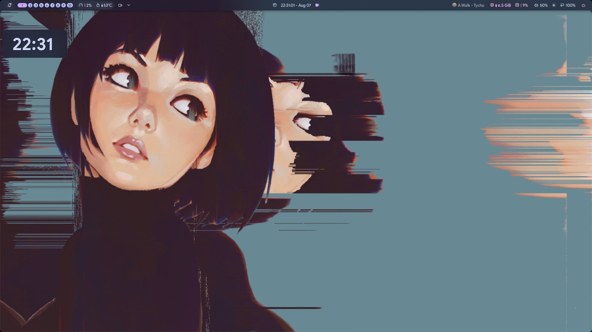
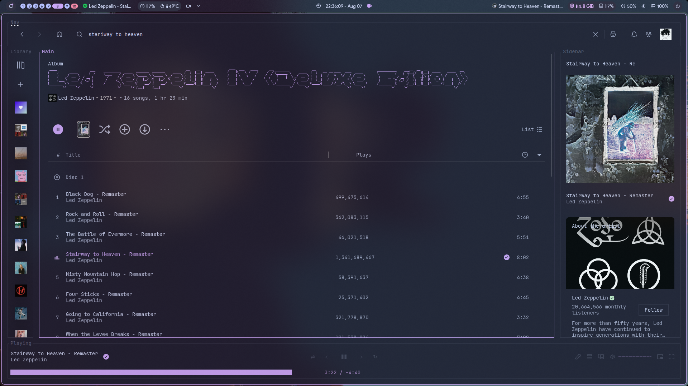
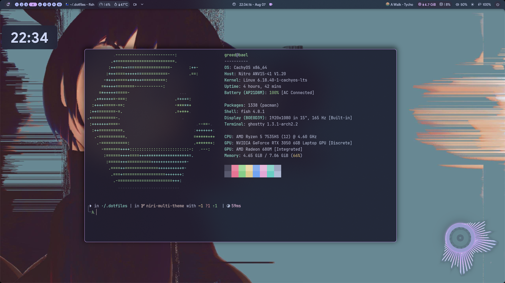

# Niri
## 🖼️ Showcase
### 🖥️ Desktop :

### 🎵 Youtube Music :

### Fetch

### 💬 Discord :

### 🧑‍💻 Neovim :

## 🛠️ Stuffs used

- **Shell** : [Noctalia](https://github.com/noctalia-dev/noctalia-shell)
- **Lockscreen** : [Made with Noctalia Widgets](https://github.com/noctalia-dev/noctalia-shell)
- **App Launcher** : [Vicinae](https://github.com/vicinaehq/vicinae)
- **Terminal** :
    - Emulator : [ghostty](https://ghostty.org/)
    - Shell : [Fish](https://fishshell.com/)
    - Prompt : [Starship](https://starship.rs/)
    - Font : [JetBrainsMono Nerd Font](https://github.com/ryanoasis/nerd-fonts)
- **Code Editor** : [Neovim](https://neovim.io/)
- **System Font** : [Google Sans](https://aur.archlinux.org/packages/ttf-google-sans)
- **Discord Client** : [vesktop](https://github.com/Vencord/Vesktop)
- **AUR Helper** : [paru](https://github.com/Morganamilo/paru)
- **File Browser** : Dolphin
- **Music Stream** : Spotify with spicetify

## ⚙️ Installation
> [!WARNING]
> This is not a installation guide just a wireframe of what you'd want to install, please keep that in mind :

- Install fonts and other stuff :
```bash
paru -S ttf-jetbrains-mono-nerd ttf-google --noconfirm
```
- Install desktop portals :
```bash
paru -S xdg-desktop-portal-gtk xdg-desktop-portal --noconfirm
```
- Install required stuff :
```bash
paru -S niri-git noctalia-git ghostty vicinae-bin app2unit zoxide starship polkit-gnome webkit2gtk plasma-integration --noconfirm
```
- Install cursor theme :
```bash
paru -S bibata-cursor-git
```
## 👽 Extra Info : 
- **Wallpaper Repository :** [orangci's collection](https://github.com/orangci/walls-catppuccin-mocha)
- **Neovim config** : [Here]( https://github.com/greed-d/nvim )
